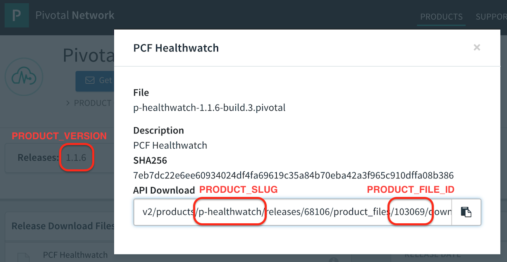

# [ops-manager-automation](./README.md)

## Prerequisites

On GCP:
- A pristine GCP project
- An SSH session on a pristine Ubuntu jumpbox with `gcloud` initialized 
([click here](./jumpbox-gcp/README.md))
- A fresh installation of Ops Manager hosted on GCP ([click here](./ops-manager-gcp/README.md))

## SSH to your jumpbox (if necessary)

From Cloud Shell:

```bash
gcloud compute ssh ubuntu@jumpbox --zone us-central1-a
```

## Clone _this_ repo (if necessary)

From the jumpbox:

```bash
git clone https://github.com/amcginlay/ops-manager-automation.git ~/ops-manager-automation

# [Clone with SSH]
git clone git@github.com:amcginlay/ops-manager-automation.git ~/ops-manager-automation
```

## Create a configuration file (if necessary)

When we installed the Ops Manager from the jumpbox we created and 
__customized__ a configuration file for your environment.  Review [those instructions](./ops-manager-gcp/README.md#create-a-configuration-file) 
and inspect the contents of the `~/.env` file.

The `scripts` in this repo will make use of the same configuration file 
to provide context for the installation.

Each task script will call `source scripts/shared.sh` to ensure that 
these name value pairs are made available as environment variables.

## Product Specific Variables

Identifiers for specific products on [Pivotal Network](https://network.pivotal.io) 
can be sourced from the Show Product Info (i) buttons within the [Pivotal Network](https://network.pivotal.io).  
See the screenshot below for clarification:



For many products, you will discover that `PRODUCT_SLUG` is identical to 
`IMPORTED_NAME` and the same is true when comparing `PRODUCT_VERSION` 
to `INSTALLED_VERSION` but there are a handful of exceptions to this 
rule.  The `list-imports.sh` script will help us identify these 
exceptions (see later).

## Task Scripts

Let's change into the directory of our cloned repo to keep our task 
script commands short:

```no-highlight
cd ~/ops-manager-automation
```

### `create-env.sh`

We always start here.  This is the script we used from the jumpbox when 
installing the Ops Manager.  It creates a template for our configuration 
at `~/.env` which we must customize before installing the Ops Manager 
or running any of the other task scripts.

_Note_ if you followed the Prerequisite instructions to create the Ops 
Manager, the `~/.env` file is likely already configured. 

Example usage:

```no-highlight
./scripts/create-env.sh
```

### `configure-authentication.sh`

This script is designed to be used against a **freshly installed** Ops 
Manager installation which has not yet had authentication configured.  
The DNS configuration **must** have fully propagated such that the 
installation is accessible via its FQDN.  This script will select 
`Internal Authentication` and configure an `admin` account with the 
password provided in `vars.txt`.  **Note** for simplicity, the 
passphrase will always be configured to match the `admin` password.

Example usage:

```no-highlight
./scripts/configure-authentication.sh
```

### `configure-director-gcp.sh`

This script should be used against an **freshly authenticated** Ops 
Manager installation to turn the Ops Manager Director tile from "orange" 
to "green".  Please inspect the `templates/director` directory to gain a 
technical appreciation for how this is achieved.

Example usage:

```no-highlight
./scripts/configure-director-gcp.sh
```

### `apply-changes-director.sh` and `apply-changes.sh`

Does exactly what it says ... clicks the big blue button!

**Note** in the case of the former script, it will only `Apply Changes` 
related to the Ops Manager Director tile.

Example usage:

```no-highlight
./scripts/apply-changes-director.sh
# or
./scripts/apply-changes.sh
```

### `download-product.sh`

This script fetches products and stemcells from PivNet and stores them 
in a directory structure beneath `downloads`.  As these files can be 
quite large, we recommend you only run this script from a Jumpbox VM 
alongside your targeted Ops Manager.  For a large products like PAS, you 
can expect this to take ~5 mins.

**Note** the script expects values for the Product Variable `PRODUCT_SLUG`, 
`PRODUCT_VERSION` and `PRODUCT_FILE_ID`

Example usage:

```no-highlight
PRODUCT_SLUG="elastic-runtime" PRODUCT_VERSION="2.1.1" PRODUCT_FILE_ID=112577 ./scripts/download-product.sh
```

### `import-product.sh`

This script takes **previously downloaded** products and stemcells from 
the directory structure beneath `downloads` and imports them to an Ops 
Manager instance.  The script will attempt to resolve any missing 
products by invoking `download-product.sh` as appropriate.  We recommend 
you only run this script from a Jumpbox VM alongside your targeted Ops 
Manager.  For a large product like PAS, you can expect this to take ~15 
mins.

**Note** the script expects values for the Product Variable 
`PRODUCT_SLUG`, `PRODUCT_VERSION` and `PRODUCT_FILE_ID` (see above)

Example usage:

```no-highlight
PRODUCT_SLUG="elastic-runtime" PRODUCT_VERSION="2.1.1" PRODUCT_FILE_ID=112577 ./scripts/import-product.sh
```

### `list-imports.sh`

Shows which products have been imported and are ready to be staged.  
Useful when establishing correct terms for `IMPORTED_NAME` and 
`IMPORTED_VERSION` variables.

Example usage:

```no-highlight
./scripts/list-imports.sh
```

### `stage-product.sh`

Whenever we click the `+` (plus) button next to an imported product in 
the Ops Manager we'll see a new or updated tile in the installation 
dashboard.  That procedure is referred to as 
**staging an imported product**.  This script automates that button 
click.

**Note** As mentioned previously, for many products, you will discover 
that `PRODUCT_SLUG` is identical to `IMPORTED_NAME` and the same is true 
of `PRODUCT_VERSION` versus `INSTALLED_VERSION` but there are a handful 
of exceptions to this rule.  For example, the PAS product uses 
`IMPORTED_NAME=cf` in contrast to `PRODUCT_SLUG=elastic-runtime`.  
(see `list-imports.sh`)

Example usage:

```no-highlight
IMPORTED_NAME="cf" IMPORTED_VERSION="2.1.1" ./scripts/stage-product.sh
```

### `mk-ssl-cert-key.sh`

Customized from the Pivotal Toolsmiths original, this script uses the 
`openssl` CLI tool to generate self-signed certificate and key files for 
use with this installation.  Generated files are deposited in the current 
working directory where they remain available for use by subsequent tile 
configuration scripts.

Example usage:

```no-highlight
./scripts/mk-ssl-cert-key.sh
```

### `configure-product.sh`

The intention of this script is to turn any given tile from "orange" to 
"green".  Please inspect the `templates/cf` and `templates/p-healthwatch` 
directories to gain a technical appreciation for how this is achieved.

Example usage:

```no-highlight
IMPORTED_NAME="cf" ./scripts/configure-product.sh
# or 
IMPORTED_NAME="p-metrics" ./scripts/configure-product.sh
```

_Note_ you may choose to run `apply-changes.sh` once after each call to 
`configure-product.sh` but it's often more time-efficient to configure 
multiple products and apply all changes as a single batch.

## Putting it all together

There now follows the sequence of commands required to automate a 
configuration/deployment of the Ops Manager Director, Pivotal Application 
Service (PAS - Small Footprint) and a handful of common products.  This 
assumes a valid `~/.env` file and a fresh install of the Ops Manager, 
the version of which is compatible with the target PAS - in this case 
v2.1.1.  These steps incorporate both a PivNet download and an Ops 
Manager import which could take a long time to complete.  As the script 
incorporates large downloads/imports, we recommend you only run this 
script from a Jumpbox VM alongside your targeted Ops Manager.

```no-highlight
# prepare director
./scripts/configure-authentication.sh
./scripts/configure-director-gcp.sh

./scripts/mk-ssl-cert-key.sh

# download stemcells and products - 25GB of downloads will take time!
PRODUCT_SLUG="stemcells" PRODUCT_VERSION="3445.28" PRODUCT_FILE_ID="86664" ./scripts/downlod-product.sh
PRODUCT_SLUG="stemcells" PRODUCT_VERSION="3445.32" PRODUCT_FILE_ID="114231" ./scripts/download-product.sh
PRODUCT_SLUG="stemcells" PRODUCT_VERSION="3468.30" PRODUCT_FILE_ID="114229" ./scripts/download-product.sh
PRODUCT_SLUG="elastic-runtime" PRODUCT_VERSION="2.1.1" PRODUCT_FILE_ID="112577" ./scripts/download-product.sh
PRODUCT_SLUG="p-mysql" PRODUCT_VERSION="1.10.12" PRODUCT_FILE_ID="87255" ./scripts/download-product.sh
PRODUCT_SLUG="p-healthwatch" PRODUCT_VERSION="1.1.6" PRODUCT_FILE_ID="103069" ./scripts/download-product.sh
PRODUCT_SLUG="p-rabbitmq" PRODUCT_VERSION="1.11.8" PRODUCT_FILE_ID="88738" ./scripts/download-product.sh
PRODUCT_SLUG="p-redis" PRODUCT_VERSION="1.11.3" PRODUCT_FILE_ID="94537" ./scripts/download-product.sh
PRODUCT_SLUG="pivotal_single_sign-on_service" PRODUCT_VERSION="1.5.3" PRODUCT_FILE_ID="36424" ./scripts/download-product.sh
PRODUCT_SLUG="aws-services" PRODUCT_VERSION="1.4.6" PRODUCT_FILE_ID="79951" ./scripts/download-product.sh
PRODUCT_SLUG="p-spring-cloud-services" PRODUCT_VERSION="1.5.2" PRODUCT_FILE_ID="88958" ./scripts/download-product.sh

# import required stemcells
PRODUCT_SLUG="stemcells" PRODUCT_VERSION="3445.28" PRODUCT_FILE_ID="86664" ./scripts/import-product.sh
PRODUCT_SLUG="stemcells" PRODUCT_VERSION="3445.32" PRODUCT_FILE_ID="114231" ./scripts/import-product.sh
PRODUCT_SLUG="stemcells" PRODUCT_VERSION="3468.30" PRODUCT_FILE_ID="114229" ./scripts/import-product.sh

# install Small Footprint PAS (NOTE PRODUCT_SLUG -> IMPORTED_NAME discrepancy)
PRODUCT_SLUG="elastic-runtime" PRODUCT_VERSION="2.1.1" PRODUCT_FILE_ID="112577" ./scripts/import-product.sh
IMPORTED_NAME="cf" IMPORTED_VERSION="2.1.1" ./scripts/stage-product.sh
IMPORTED_NAME="cf" ./scripts/configure-product.sh

# install MySQL
PRODUCT_SLUG="p-mysql" PRODUCT_VERSION="1.10.12" PRODUCT_FILE_ID="87255" ./scripts/import-product.sh
IMPORTED_NAME="p-mysql" IMPORTED_VERSION="1.10.12" ./scripts/stage-product.sh
IMPORTED_NAME="p-mysql" ./scripts/configure-product.sh

# install Healthwatch
PRODUCT_SLUG="p-healthwatch" PRODUCT_VERSION="1.1.6" PRODUCT_FILE_ID="103069" ./scripts/import-product.sh
IMPORTED_NAME="p-healthwatch" IMPORTED_VERSION="1.1.6-build.3" ./scripts/stage-product.sh
IMPORTED_NAME="p-healthwatch" ./scripts/configure-product.sh

# install RabbitMQ
PRODUCT_SLUG="p-rabbitmq" PRODUCT_VERSION="1.11.8" PRODUCT_FILE_ID="88738" ./scripts/import-product.sh
IMPORTED_NAME="p-rabbitmq" IMPORTED_VERSION="1.11.8" ./scripts/stage-product.sh
IMPORTED_NAME="p-rabbitmq" ./scripts/configure-product.sh

# install Redis
PRODUCT_SLUG="p-redis" PRODUCT_VERSION="1.11.3" PRODUCT_FILE_ID="94537" ./scripts/import-product.sh
IMPORTED_NAME="p-redis" IMPORTED_VERSION="1.11.3" ./scripts/stage-product.sh
IMPORTED_NAME="p-redis" ./scripts/configure-product.sh

# install SSO (NOTE PRODUCT_SLUG -> IMPORTED_NAME discrepancy)
PRODUCT_SLUG="pivotal_single_sign-on_service" PRODUCT_VERSION="1.5.3" PRODUCT_FILE_ID="36424" ./scripts/import-product.sh
IMPORTED_NAME="Pivotal_Single_Sign-On_Service" IMPORTED_VERSION="1.5.3" ./scripts/stage-product.sh
IMPORTED_NAME="Pivotal_Single_Sign-On_Service" ./scripts/configure-product.sh

# install SCS
PRODUCT_SLUG="p-spring-cloud-services" PRODUCT_VERSION="1.5.2" PRODUCT_FILE_ID="88958" ./scripts/import-product.sh
IMPORTED_NAME="p-spring-cloud-services" IMPORTED_VERSION="1.5.2" ./scripts/stage-product.sh
IMPORTED_NAME="p-spring-cloud-services" ./scripts/configure-product.sh

# install AWS Broker
PRODUCT_SLUG="aws-services" PRODUCT_VERSION="1.4.6" PRODUCT_FILE_ID="79951" ./scripts/import-product.sh
IMPORTED_NAME="aws-services" IMPORTED_VERSION="1.4.6" ./scripts/stage-product.sh
IMPORTED_NAME="aws-services" PCF_AWS_ACCESS_KEY_ID="SOME_ID" PCF_AWS_SECRET_ACCESS_KEY="SOME_SECRET" ./scripts/configure-product.sh

# apply changes
./scripts/apply-changes.sh
```
